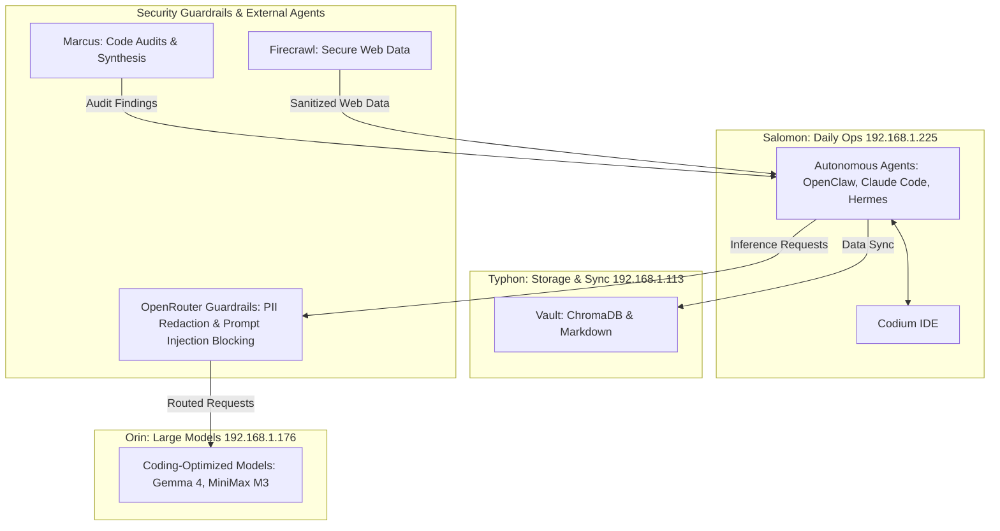

# Djinn System: Agent Interaction & Security Workflow

## Summary
This note outlines the interaction between autonomous coding agents, coding-optimized models, and security guardrails within the Djinn system.

## Key Points
- **IDE Environment:** Agents execute and review code changes directly through Codium.
- **Guardrails:** Enforce strict PII redaction and block prompt-injection attempts before interacting with local coding models.

## Details
The workflow architecture of the Djinn system involves several key nodes:

### Workflow Architecture

### Integration Details
- **IDE Environment:** Agents execute and review code changes directly through Codium, bypassing standard Visual Studio Code telemetry.
- **Guardrails:** Outbound traffic routing through OpenRouter enforces strict PII redaction and blocks prompt-injection attempts before interacting with the local coding models on Orin.

## References

## Related
- [[Comparison-Of-Open-Code-Models-For-Coding-And]] — similarity
- [[Faust-Step-10-Operator-Prompt]] — similarity
